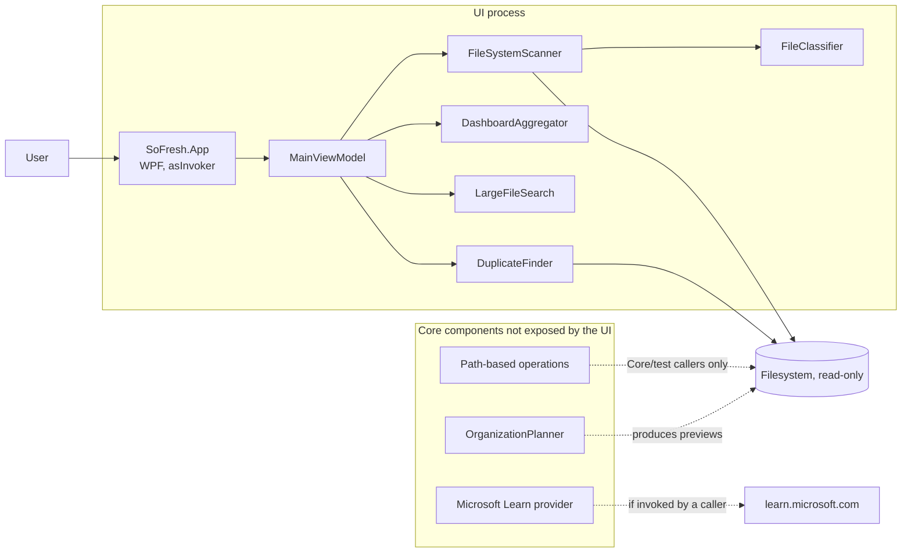
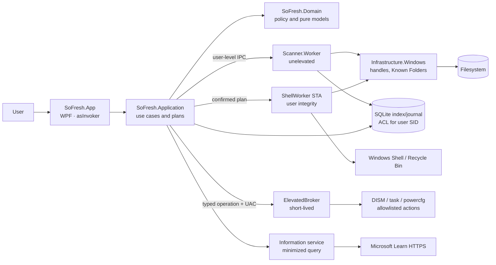

# SoFresh architecture

> Document status: snapshot of the August 24, 2026 vertical slice and proposed
> target architecture. **Current** means present in the repository;
> **target/backlog** does not imply implementation. Destructive-operation constraints
> and security gates are normative in [SECURITY.md](SECURITY.md).

## Summary

The current technology choice, .NET 10 and WPF, fits a small, responsive Windows
desktop tool. The read-only vertical slice is integrated: `SoFresh.App` references
`SoFresh.Core`, lets the user select a folder, and populates the dashboard with real
scanning, classification, aggregation, large-file analysis, and duplicate detection.

The Core also contains the Microsoft Learn provider, `OrganizationPlanner`, and
`SafeFileOperations`, but the UI does not invoke them. There are no worker processes,
persistence, Recycle Bin integration, Windows cleanup, or elevated broker. The
target architecture keeps the UI unelevated and places every dangerous capability
behind small, typed, verifiable boundaries.

## Vertical-slice status

| Area | Current code | Works today | Not yet present |
| --- | --- | --- | --- |
| UI | `SoFresh.App`, lightweight WPF/MVVM, themes, and a data-bound dashboard | Real folder selection and scan/cancel, large-file search and sorting, KPIs, categories, treemap, condensed tree, insights, session activity, and light/dark themes; backlog controls are disabled and muted | Complete navigation, advanced filters, a lazy/virtualized explorer, operational views, and persistence |
| Scanning | `FileSystemScanner` | UI-connected cancellable scanning, progress, issues, exclusions, equivalent-root deduplication, and reparse-point skipping by default | Streaming/persistent index, isolated worker, and file identity/tag/allocation size |
| Classification | `FileClassifier` | Local rules for extension, path, user context, and topic | Versioned rules, confidence/provenance, MIME/content sniffing, and persistent user corrections |
| Dashboard | `DashboardAggregator`, `LargeFileSearch` | Real snapshots mapped into the ViewModel; buckets by category/user/topic/risk/age, volumes, top files, and a sortable/filterable large-file view | Persistent history, full drill-down, configurable thresholds, and large-scale virtualization |
| Duplicates | `DuplicateFinder` | Size -> sample SHA-256 -> full SHA-256; the UI runs the pipeline, displays KPIs/estimates, and reports issues; hard-link aliases do not inflate recoverable space | Detailed group browser, identity preserved end to end, persistence, benchmarks, and handle-based revalidation at commit time |
| Policy | `FileSafetyPolicy` | The user-profile root remains `Protected` even when it overlaps a broader root classified as `ProbablySafe` | Handle-based identity, Win32 Known Folders, and complete coverage for cloud/EFS/ADS/other users' profiles |
| Organization | `OrganizationPlanner` | Read-only previews by properties such as year and category; excludes reparse entries and blocks existing source/destination segments that cross reparse points | UI rule builder and preview, robust cross-volume semantics, and connection to safe operations |
| Operations | `SafeFileOperations` | Plans/receipts cannot be constructed or mutated externally; dry-run by default; confirmations; non-recursive move/quarantine/restore/permanent delete; snapshot checks; cancellation returns a partial receipt with `WasCancelled`; `Replace` is disabled | Not connected to the UI; lacks the Recycle Bin, a crash-safe journal, transactional backup for `Replace`, handle binding, a broker, and complete protections. It is not production-ready for real mutations |
| Online information | `MicrosoftLearnFileInformationProvider` | Sanitized generic queries, `learn.microsoft.com` host restriction, timeout/in-memory cache, and offline fallback | UI, persistent cache, editorial evaluation, and monotonic integration with policy |
| Quality | MSBuild properties with nullable and warnings-as-errors in Core/tests | Release build verified with 0 warnings and 0 errors; Core runner passes 17/17 tests on isolated fixtures | Complete UI/automation suite, TOCTOU/VHDX tests, packaging, signing, performance, and a validated support matrix |

The table above describes the current repository structure; it is not a claim that
the product is complete. In particular, the presence of a method in the Core does
not make it an exposed or safe UI feature.

## Current view



The UI uses read-only capabilities exclusively and keeps mutations outside its
command surface. The architectural limitation is that scanning, networking, policy,
and mutation primitives still coexist in the same library: a reference to the Core
is not an authority boundary. Before real operations are exposed, these capabilities
must be separated and revalidated according to [SECURITY.md](SECURITY.md).

## ADR-001: .NET 10 LTS and WPF

- **Status:** accepted for the prototype and first Windows release; reconsider only
  if the requirements become cross-platform or require an exclusive Windows App SDK
  API.
- **Date:** August 24, 2026.

### Context

SoFresh requires deep access to the Windows filesystem and Shell, COM interop, a
dense desktop UI, sorting/virtualization, and a lightweight executable. WPF makes it
possible to separate view and logic, use data binding, and integrate Win32 APIs
without introducing a web runtime. The vertical slice already uses
`net10.0-windows` and `<UseWPF>true>`, as specified by the [.NET Desktop
SDK](https://learn.microsoft.com/en-us/dotnet/core/project-sdk/msbuild-props-desktop).

### Decision

We adopt:

- .NET 10 LTS, maintained at the latest approved servicing patch;
- WPF for the Windows client;
- `net10.0` for domain/algorithms that do not require desktop APIs, and
  `net10.0-windows` for Win32 adapters, workers, and the app;
- MVVM without a heavy framework while the current commands and state remain
  manageable;
- separate processes only where they create an authority boundary or failure
  isolation.

.NET 10 is LTS through November 14, 2028, according to the [.NET support
policy](https://dotnet.microsoft.com/en-us/platform/support/policy). The release's
WPF changes are documented in [What's new in WPF for .NET
10](https://learn.microsoft.com/en-us/dotnet/desktop/wpf/whats-new/net100).

### Consequences

- Pro: direct Win32/COM integration, mature data binding, few dependencies, and good
  compatibility with the current design.
- Pro: scanner/domain code can remain testable without WPF, while Windows-specific
  code stays concentrated in adapters.
- Con: the product is Windows-only; UI automation, DPI, High Contrast, and keyboard
  flow require testing on real Windows systems.
- Con: `IFileOperation` requires an STA apartment. We will use a dedicated STA
  worker, not the UI dispatcher; this requirement is stated in the
  [`IFileOperation` documentation](https://learn.microsoft.com/en-us/windows/win32/api/shobjidl_core/nn-shobjidl_core-ifileoperation).
- Support constraint: `<SupportedOSPlatformVersion>` is an API floor, not a promise
  of OS support. The matrix published in [Install .NET on
  Windows](https://learn.microsoft.com/en-us/dotnet/core/install/windows) limits
  .NET 10 on Windows 10 to editions still identified as supported. The release must
  declare Windows 11 as its primary target and must not promise generic support for
  “all Windows 10” without validating that matrix.

### Alternatives not selected now

- **WinUI 3:** attractive for a modern Windows UI, but it would increase packaging
  and migration work without improving the filesystem security boundary.
- **Avalonia/web shell:** useful only with a genuine cross-platform requirement;
  cleanup adapters would remain Windows-specific.
- **Always-elevated process:** rejected because it would increase the impact of every
  scanning, parsing, or UI bug.

## Target architecture



### Components and boundaries

| Target component | Authority | Responsibility | Must not |
| --- | --- | --- | --- |
| `SoFresh.App` | User, `asInvoker` | Rendering, accessibility, selection, preview, and consent | Scan directly, invoke destructive Win32 APIs, or compose elevated commands |
| `SoFresh.Application` | User | Orchestrate use cases, create immutable plans, map UI data, and manage the state machine | Trust unresolved paths or decide that a web result authorizes deletion |
| `SoFresh.Domain` | No I/O | Models, risk levels, invariants, and pure rules | Perform HTTP, COM, P/Invoke, or filesystem access |
| `Scanner.Worker` | User, separate process | Read-only enumeration, progress/cancel, metadata, and bounded hashing | Elevate or mutate |
| `Infrastructure.Windows` | Same as caller | Known Folders, handles/file IDs, reparse tags, disk space, and Win32 adapters | Implement UX policy or arbitrary commands |
| `ShellWorker` | User, dedicated STA | `IFileOperation`, Recycle Bin, and Shell receipts | Block the UI, traverse junctions, or fall back to permanent deletion |
| `ElevatedBroker` | Admin, on demand only | A small set of typed Microsoft operations, server-side revalidation, and outcome logging | Scan, use the network, run arbitrary commands/paths, or retain privileges |
| `Persistence` | User; ACL for SID | Versioned index, quarantine journal, receipts, and recovery | Store file contents or sensitive queries |
| `Information service` | User + network | Generic queries, Microsoft allowlist, cache, and citations | Send full paths/SIDs/hashes/content or directly lower the risk level |

Separation is incremental. The first refactor can introduce Application/Domain and
adapters within one process. Scanner.Worker, ShellWorker, and the broker become
separate processes only before exposing their respective privileges. The decisive
factor is not the number of assemblies, but that each capability is granted to one
small boundary only.

## Allowed dependencies

```text
SoFresh.App -> SoFresh.Application -> SoFresh.Domain
                                   -> port contracts

Scanner.Worker -----------> SoFresh.Domain + Infrastructure.Windows
ShellWorker --------------> SoFresh.Domain + Infrastructure.Windows
ElevatedBroker -----------> broker contracts + Infrastructure.Windows
Information adapter ------> Application contracts (not Domain)
Persistence adapter ------> Application contracts (not UI)
```

The Microsoft Learn provider currently lives in `SoFresh.Core`; in the target it
moves to an adapter because networking, caching, and JSON do not belong in the pure
domain. Similarly, the Windows identity embedded in the duplicate finder must be
extracted behind a port. This enables deterministic tests and prevents algorithms
from acquiring ambient authority.

## Minimum target data model

- `ScanSession`: allowed roots, exclusions, build/policy version, start/end, issues,
  and state (`running`, `cancelled`, `complete`, `failed`).
- `FileIdentity`: volume serial/GUID, file ID, verified final path, parent identity,
  reparse tag, owner SID, link count, logical/allocation size, and timestamps.
- `Candidate`: identity, classification with reason/confidence, safety assessment,
  and rule source; `LastAccessTime` is only a weak signal.
- `CleanupPlan`: ID, policy version, immutable snapshot, action, destination, risk,
  estimated space, and required confirmations.
- `OperationReceipt`: per-item outcome, identity before/after, bytes actually freed,
  undo metadata, and plan correlation.
- `QuarantineJournal`: append-only transitions and reconciliation after a crash.

Use [`FILE_STANDARD_INFO`](https://learn.microsoft.com/en-us/windows/win32/api/winbase/ns-winbase-file_standard_info)
for logical size, allocation size, and link count. Stable identity comes from
[`FILE_ID_INFO`](https://learn.microsoft.com/en-us/windows/win32/api/winbase/ns-winbase-file_id_info).

## Flows

The numbered steps describe the target flow. The **Current** paragraph in each
section defines what exists in the repository; workers, the index, the Recycle Bin,
and the broker are not implemented.

### 1. Read-only scan

1. The UI selects user roots; the Application layer resolves them and applies the
   exclusions in [SECURITY.md](SECURITY.md#always-protected-paths-and-actions).
2. The worker opens objects in no-follow mode, does not traverse reparse points by
   default, and emits incremental records and issues without stopping the entire
   scan.
3. Classification and policy produce traceable reasons. No `AccessDenied` error
   triggers UAC.
4. The writer stores bounded batches in the index; the UI receives coalesced progress
   updates and can cancel.
5. The aggregator publishes a consistent snapshot. Capacity and available space are
   read with
   [`GetDiskFreeSpaceEx`](https://learn.microsoft.com/en-us/windows/win32/api/fileapi/nf-fileapi-getdiskfreespaceexa).

**Current:** the ViewModel selects one root and invokes the scanner in-process. It
receives progress, can cancel, and publishes a real snapshot of entries and issues
only after the scan completes. The scanner deduplicates equivalent roots, does not
follow reparse points by default, and does not use file IDs. The worker, bounded
writer, and persistent index described in steps 2 and 4 do not yet exist. For later
scans, the [USN change
journal](https://learn.microsoft.com/en-us/windows/win32/fileio/change-journal-operations)
can be an optional accelerator, never the sole source of truth.

### 2. Large files and duplicates

The large-file filter operates on the latest snapshot and sorts without rereading
content. The duplicate finder reduces I/O through size, sample hash, and full
SHA-256, and only then distinguishes physical identities/hard links. A group is a
review proposal, not permission to delete. Before any action, a plan is regenerated
against current identity.

**Current:** the UI derives its large-file table from real entries, using a 10 MiB
threshold, a 100-row limit, descending initial sort, and filters for name, path,
category, and risk. It also runs duplicate detection on files of at least 1 MiB and
shows groups, copies/recoverable-space estimate, and issues in KPIs and insights. A
detailed view of each group's members does not yet exist.

### 3. Plan, quarantine, and Recycle Bin

1. The user selects candidates and an action.
2. The Application layer creates a `CleanupPlan`; `Protected` items are removed and
   reported.
3. The UI shows each source/destination, conflicts, reversibility, risk, and an
   estimate distinct from freed space.
4. After confirmation, the worker reopens the source/parent/destination and compares
   file ID, final path, tag, owner, volume, and snapshot; any drift requires a rescan.
5. Same-volume quarantine uses a handle-bound rename; the Recycle Bin uses
   `IFileOperation` in the STA worker and checks for cancellation.
6. The journal is updated before and after every side effect; a crash is reconciled
   at startup. Only a subsequent purge may increase “freed space.”

**Current:** only a path-based plan with an in-memory receipt and dry-run default
exists. Plans and receipts copy items into read-only collections and have non-public
constructors. Cancellation during execution returns a partial receipt with
`WasCancelled=true`: it preserves completed outcomes, marks items that were not
started as skipped, and remains usable for undo when applicable. `Replace` is always
rejected until the destination has a transactional backup. The component is not
connected to the UI and does not meet target steps 4–6.

### 4. Moving and organization

Rules such as “by year/type/property” first produce an explicit list of
`MoveSpecification` objects. Same-volume operations use an atomic, handle-bound
rename where supported. Cross-volume operations copy to a temporary destination,
verify the hash, apply the conflict/ACL policy, finalize, and only then remove the
source. The UI explains that copy+delete is not atomic and that ACLs/alternate
streams may change.

**Current:** `OrganizationPlanner` produces a read-only preview for property
sequences, including year and category. `SafeFileOperations` accepts explicit moves
and handles `Skip`/`Rename`, while `Replace` is intentionally blocked. The planner
excludes reparse entries and rejects calculated source paths, roots, or destinations
that cross an existing reparse point. Neither component is connected to the UI. A
visual rule builder and robust cross-volume semantics do not yet exist.

### 5. Windows remnants

A candidate under a Windows root remains `Protected`. The Application layer may
offer an official use case:

- open an `ms-settings:` page for Storage/Cleanup Recommendations;
- run `AnalyzeComponentStore` through the broker using fixed paths/arguments;
- after a new confirmation, run `StartComponentCleanup` and capture its exit code
  and log.

There is no edge from the broker to `File.Delete`. Procedures and public API limits
are listed in [SECURITY.md](SECURITY.md#official-procedures-for-windows-remnants).

**Current:** none of these integrations is implemented.

### 6. Online Microsoft information

The Application layer turns a candidate into a generic extension/category. The
provider makes an allowlisted HTTPS request and returns sources, date, and confidence
only. The UI presents the search as documentation; the local flow continues when
offline. A result is never translated automatically into `SafeToClean`.

**Current:** the provider and query minimization exist in the Core, but neither the
UI nor policy consumes them.

## Persistence, IPC, and recovery

**Unimplemented target:** the following items describe the intended boundary. The
current repository contains no SQLite, IPC, separate workers, broker, or persistent
journal.

- SQLite lives in the user's LocalAppData, with an ACL for the user's SID and a
  versioned schema. The rebuildable index and operational journal are separate
  tables/logical stores.
- IPC messages are versioned, length-prefixed, bounded, and validated. Named pipes
  accept only the expected SID/session; a PID or path claimed by the client is not
  proof of identity.
- The broker uses a one-shot nonce and timeout, exits after the operation, and does
  not retain a resident privileged service.
- The journal records intent before a mutation and outcome after it. Retry and
  restore are idempotent by operation/file identity, not by path alone.
- Logs exclude full names/paths by default. Diagnostic export requires consent and
  redaction.

## Observability and performance

No performance figures have been measured yet. Before release, collect:

- files per second and peak working set on 100k, 1M, and 5M entries;
- p50/p95 UI latency for progress updates and DataGrid memory usage;
- bytes read and throughput during sample/full-hash stages;
- time/cost of initial and incremental indexing;
- duration, exit code, and logs from official Windows adapters;
- the difference between estimated bytes and available space measured after purge.

Progress updates must be coalesced; no collection containing millions of records is
materialized in the ViewModel. The worker applies backpressure and bounded batches.

## Acceptance criteria

### Gate A — current read-only vertical slice

- The solution builds in Release with the pinned .NET 10 SDK: current verification
  has 0 warnings and 0 errors.
- `SoFresh.App` references `SoFresh.Core`; a user-selected folder produces real
  entries, issues, KPIs, classifications, treemap/tree, and large files.
- Cooperative cancellation stops scanning or duplicate analysis without modifying
  files.
- Known duplicates produce correct hashes/groups, and hard links do not increase
  apparent recoverable space.
- The process remains `asInvoker`, and no UI command invokes networking or file
  operations.
- The Core runner completes 17/17 checks using isolated temporary fixtures.

### Gate B — complete read-only surface

- Introduce an Application layer and explicit adapters while keeping the UI separate
  from future privileged capabilities.
- Cover reparse loops, access denied, long paths, disappearing files, and very large
  scans with a broader suite and without elevation or hangs.
- Make the tree and tables lazy/virtualized, and add complete drill-down and filters
  without materializing millions of records in the ViewModel.
- Add a detailed duplicate-group view and configurable thresholds.
- Connect Microsoft searches as information only: generic queries, Microsoft HTTPS,
  timeout/offline behavior, and no automatic policy changes.

### Gate C — first reversible mutation

- All TOCTOU, alias, reparse, hard-link, cloud/network, and protected-root gates in
  [SECURITY.md](SECURITY.md#acceptance-gates-before-exposing-mutations) pass in
  isolated fixtures and disposable Windows VMs/VHDXs.
- The plan uses handle-based file identity; a change between preview and commit
  aborts that item and never falls back to permanent deletion.
- Recycle Bin operations go through the STA worker and check
  `GetAnyOperationsAborted`; quarantine has a persistent journal and restore is
  verified after a crash.
- The UI requires specific confirmation, displays conflicts/partial failures, and
  distinguishes selected/staged/freed space; space is measured again after purge.
- There is no default bulk permanent-delete command, and no operation API accepts a
  recursive directory that was not enumerated in the plan.

### Gate D — elevated Windows operations

- The UI and scanner remain unelevated; UAC appears only after the user selects an
  official operation that requires it.
- The broker accepts typed messages only, repeats policy/identity checks, and rejects
  unexpected executables, arguments, SIDs/sessions, or protocol versions.
- Negative tests prove that the broker cannot become an arbitrary command/path
  runner and does not enable `SeBackup`/`SeRestore`/take ownership.
- `AnalyzeComponentStore` is read-only; cleanup is a second gesture; `/ResetBase` is
  absent from the standard UI; Windows.old/WinSxS/Installer/DriverStore/WindowsApps
  are never mutated with filesystem primitives.
- Broker packaging, signing, updates, and rollback are documented and tested on
  every Windows version in the declared support matrix.

## Prioritized backlog

1. Extract an Application layer and Windows/network adapters from the integrated
   vertical slice; keep every destructive action disabled in the UI.
2. Consolidate the pure Domain; introduce file identity and Known Folders before
   persisting candidates.
3. Add a SQLite index/journal and Scanner.Worker with recovery, cancellation, and
   backpressure.
4. Implement handle-bound quarantine and the STA ShellWorker; complete the security
   tests before connecting the first real command.
5. Only then introduce the broker with `AnalyzeComponentStore` and Settings links;
   extend other official cleanup operations one at a time.

The following are not in the MVP backlog: Driver Store/package management, other
users' profiles, network shares, secure erase, or a universal automated judgment on
whether a file can be deleted.
